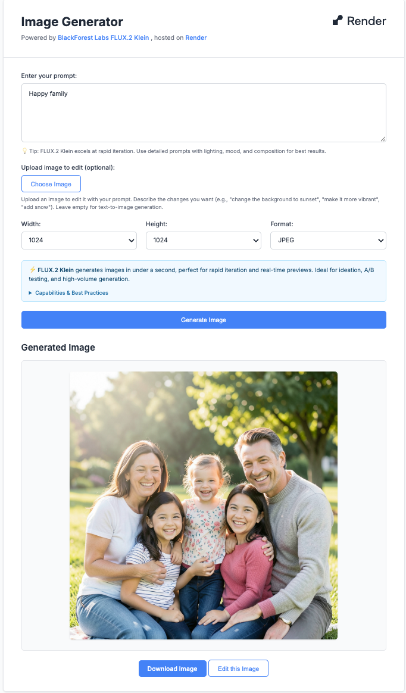

# Image Generation Site - BlackForest Labs FLUX.2 Klein

A web application that generates images using the BlackForest Labs FLUX.2 Klein API. FLUX.2 Klein is optimized for **real-time, interactive image generation** with sub-second inference times, making it perfect for rapid iteration, A/B testing, and high-volume generation workflows.

## Screenshot



## Why FLUX.2 Klein?

FLUX.2 Klein is designed for:
- **Real-time generation**: Sub-second inference (under 1 second)
- **Rapid iteration**: Perfect for ideation, previews, and quick mockups
- **High-volume workflows**: Cost-effective for bulk generation and A/B testing
- **Interactive tools**: Ideal for live previews and instant creative feedback
- **Local deployment**: Can run on consumer GPUs (~13GB VRAM) with open weights

**Best for**: Design tools, rapid prototyping, bulk catalog generation, interactive content creation, and real-time variant generation.

**Not ideal for**: Final production assets requiring maximum fidelity (use FLUX.2 Pro or Max instead).

## Features

- **Text-to-Image Generation**: Generate images from text prompts using FLUX.2 Klein 4B (sub-second generation)
- **Image Editing**: Upload an image and edit it with text prompts describing the changes you want
- **Edit Generated Images**: Click "Edit this Image" on any generated image to make further edits
- Customizable image dimensions (64×64 to 4MP, e.g., 2048×2048)
- All dimensions must be multiples of 16
- Download generated images
- Modern, responsive UI matching Render's dashboard design
- Real-time generation status with polling
- Fast inference: FLUX.2 Klein uses fixed 4 inference steps for optimal speed

## Prerequisites

- Node.js (v14 or higher)
- npm or yarn
- BlackForest Labs API key (get one at [bfl.ai](https://bfl.ai))

## Setup

1. **Install dependencies:**
   ```bash
   npm install
   ```

2. **Create a `.env` file in the root directory:**
   ```bash
   BFL_API_KEY=your_bfl_api_key_here
   ```
   
   Get your API key from [BlackForest Labs](https://bfl.ai)

3. **Start the server:**
   ```bash
   npm start
   ```

4. **Open your browser:**
   Navigate to `http://localhost:3000`

## API Endpoints

### POST `/api/generate`

Generates an image from text or edits an existing image.

**Request Body (Text-to-Image):**
```json
{
  "prompt": "A beautiful sunset over mountains, digital art style",
  "width": 1024,
  "height": 1024,
  "output_format": "jpeg",
  "seed": 12345,
  "safety_tolerance": 2
}
```

**Request Body (Image Editing):**
```json
{
  "prompt": "Change the background to a sunset, make it more vibrant",
  "input_image": "data:image/jpeg;base64,...",
  "width": 1024,
  "height": 1024,
  "output_format": "jpeg"
}
```

**Parameters:**
- `prompt` (required): Text description of the image or changes to make
- `input_image` (optional): Base64-encoded image for editing. If provided, enables image editing mode
- `width` (required for text-to-image, optional for editing): Image width (must be multiple of 16, 64-2048)
- `height` (required for text-to-image, optional for editing): Image height (must be multiple of 16, 64-2048)
- `output_format` (optional): "jpeg" or "png" (default: "jpeg")
- `seed` (optional): Integer for reproducible results
- `safety_tolerance` (optional): Integer 0-5 (0=strict, 5=permissive, default: 2)

**Response:**
```json
{
  "success": true,
  "image_url": "https://...",
  "task_id": "...",
  "request_id": "...",
  "expires_in": 600
}
```

### POST `/api/convert-image`

Converts an image URL to base64 format (used internally for editing generated images).

**Request Body:**
```json
{
  "imageUrl": "https://..."
}
```

**Response:**
```json
{
  "success": true,
  "base64": "data:image/jpeg;base64,...",
  "contentType": "image/jpeg"
}
```

### GET `/health`

Health check endpoint.

**Response:**
```json
{
  "status": "ok"
}
```


## How It Works

### Text-to-Image Generation

1. User enters a prompt and selects image dimensions/format
2. Frontend sends request to backend `/api/generate` endpoint
3. Backend submits request to BlackForest Labs API (`flux-2-klein-4b` model)
   - Uses FLUX.2 Klein 4B for sub-second generation
   - Supports resolutions from 64×64 to 4MP (e.g., 2048×2048)
   - All dimensions must be multiples of 16
4. Backend polls the API until image is ready (typically <1 second, max 60 seconds)
5. Generated image URL is returned to frontend
6. Image is displayed and can be downloaded or edited further

### Image Editing

1. **Upload & Edit**: User uploads an image (converted to base64) and enters a prompt describing changes
2. **Edit Generated Image**: User clicks "Edit this Image" on a generated result
   - The image URL is used directly (BFL API supports URLs for `input_image`)
   - Image is loaded into the editor preview
3. Frontend sends request with `input_image` parameter (URL or base64) to `/api/generate`
4. Backend processes the editing request (same polling workflow as generation)
5. Edited image is returned and displayed

## Project Structure

```
image-generation/
├── server.js          # Express backend server
├── package.json       # Dependencies and scripts
├── .env              # Environment variables (create this)
├── .gitignore        # Git ignore file
├── public/           # Frontend files
│   ├── index.html    # Main HTML page
│   ├── styles.css    # Styling
│   ├── script.js     # Frontend JavaScript (image generation & editing)
│   └── img/          # Screenshots and images
│       └── image.png  # Application screenshot
└── README.md         # This file
```

## FLUX.2 Klein Capabilities

- **Text-to-Image**: Generate images from text prompts
- **Image Editing**: Edit existing images by uploading or selecting generated images
- **Edit Generated Images**: Click "Edit this Image" to iteratively refine generated results
- **Multi-Reference Images**: Support for up to 4 reference images for style/character consistency (API supports this, UI coming soon)
- **Structured Prompting**: Works well with detailed prompts including lighting, mood, composition, camera angles
- **Fixed 4 Steps**: Uses distilled model with 4 inference steps for speed (not configurable)

## Notes

- The API uses asynchronous processing, so the backend polls for results
- Maximum polling time is 60 seconds (120 attempts × 0.5s) - though Klein typically completes in <1 second
- **Signed image URLs expire after ~10 minutes** - for best results when editing generated images, click "Edit this Image" within a few minutes of generation
- Image editing supports both URLs (for generated images) and base64 (for uploaded files) - large base64 images may take longer to upload (server limit: 20MB)
- Generated images use URLs directly (BFL API supports this), avoiding conversion overhead
- Make sure your API keys (BFL) are kept secure and never committed to version control
- FLUX.2 Klein is optimized for speed and volume, not maximum quality - use Pro or Max for final production assets

## Troubleshooting

- **"BFL API key not configured"**: Make sure you've created a `.env` file with your `BFL_API_KEY`
- **Generation timeout**: FLUX.2 Klein typically generates in <1 second, but queue times can add 10-60+ seconds during high load
- **Rate limit errors (429)**: Maximum 24 active tasks per account. Wait and retry if you hit this limit
- **Dimension errors**: All dimensions must be multiples of 16, minimum 64×64, maximum 4MP total
- **"Failed to load image for editing"**: The signed URL may have expired (expires after ~10 minutes) or there may be CORS restrictions. Generate a new image and edit it immediately, or upload your own image. Note: Preview may fail due to CORS, but the API call will still work if the URL is valid
- **"PayloadTooLargeError"**: Large base64 images may exceed limits. The server is configured for up to 20MB, but very large images may still cause issues
- **CORS errors**: The server includes CORS middleware and uses server-side image conversion to avoid CORS issues with signed URLs

